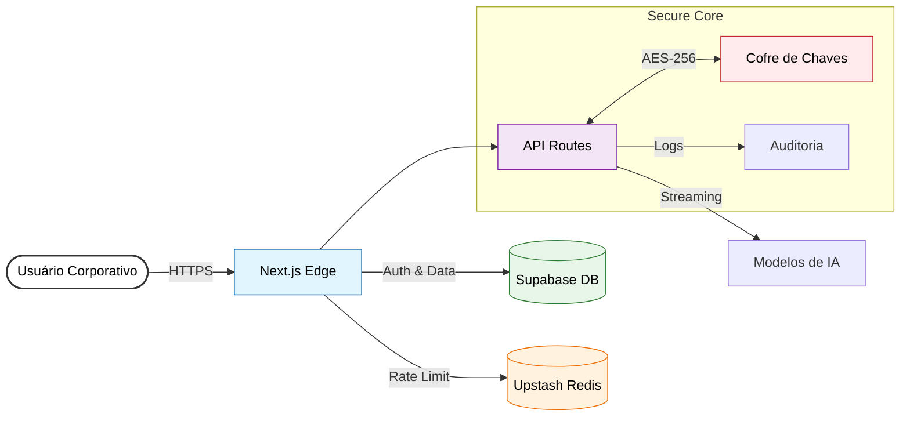

# ControlAI - Plataforma de IA Corporativa Segura

<div align="center">

[]()
[]()
[]()
[]()

**A ponte segura entre sua empresa e a Inteligência Artificial.**
*Gerencie, audite e escale o uso de IA com privacidade absoluta.*

[Demonstração (Prod)](https://control-ai-xi.vercel.app) • [Ambiente Dev](https://control-ai-dev.vercel.app/) • [Documentação](./docs/PRD.md)

</div>

---

## 🦅 Sobre o Projeto

O **ControlAI** é uma solução SaaS enterprise-grade que permite às empresas disponibilizarem modelos de IA de ponta (GPT-4o, Claude 3.5 Sonnet) para seus colaboradores em um ambiente controlado. Diferente do ChatGPT padrão, aqui a empresa detém a custódia total dos dados e chaves.

### Diferenciais Competitivos
- **🔐 Privacidade Zero-Trust**: Seus dados nunca são usados para treinar modelos públicos.
- **🗝️ Arquitetura BYOK (Bring Your Own Key)**: A empresa conecta sua própria chave API. Nós não cobramos ágio sobre tokens.
- **⚡ Performance Global**: Infraestrutura Edge-ready com Next.js 14.

---

## 🏗️ Arquitetura do Sistema



---

## 🚀 Funcionalidades Chave

### 🛡️ Segurança & Compliance
*   **Isolamento de Dados**: Implementação rigorosa de **Row Level Security (RLS)** no banco de dados. Um tenant nunca acessa dados de outro.
*   **Criptografia em Repouso**: Todas as chaves de API (OpenAI/Anthropic) são criptografadas com **AES-256-GCM** antes de serem salvas no banco.
*   **Proteção Anti-Abuso**: Rate limiting distribuído via **Redis** (Upstash) para evitar ataques DDoS e custos inesperados.

### 🧠 Gestão de IA
*   **Agentes Personalizados**: Crie personas (ex: "Especialista em RH", "Jurídico Senior") com prompts de sistema travados.
*   **Multi-Model**: Alterne entre GPT-4o e Claude 3.5 Sonnet na mesma interface sem interrupções.
*   **Gestão de Sessão**: Histórico de chat persistente e contextual.

### 💰 Faturamento & Assinaturas
*   **Stripe Integration**: Assinaturas mensais/anuais com webhooks automatizados para provisionamento de acesso.
*   **Portal do Cliente**: O cliente gerencia upgrades e downgrades autonomamente.

---

## � Acesso de Demonstração

Para testar a plataforma em produção sem criar conta:

- **URL**: [https://control-ai-xi.vercel.app/login](https://control-ai-xi.vercel.app/login)
- **Email**: `demo@control.ai`
- **Senha**: `demo1234`

> **Nota**: Este usuário possui nível de acesso `Tenant Admin`, permitindo visualizar o dashboard completo e criar agentes.

## �💻 Tech Stack

| Categoria | Tecnologia | Justificativa |
|:---|:---|:---|
| **Frontend** | Next.js 14 (App Router) | Renderização híbrida e ótima DX. |
| **Estilização** | Tailwind CSS + Shadcn/ui | Design system moderno e acessível. |
| **Backend/DB** | Supabase (PostgreSQL) | Auth robusto e Realtime out-of-the-box. |
| **Cache/Limiter** | Upstash (Redis) | Baixa latência para controle de tráfego na Edge. |
| **Pagamentos** | Stripe | Padrão global para assinaturas SaaS. |
| **Emails** | Brevo | Entregabilidade transacional confiável. |

---

## ⚙️ Instalação e Configuração

### Pré-requisitos
- Node.js 18+
- Conta no Supabase & Stripe

### Passo a Passo

1.  **Clone o repositório**
    ```bash
    git clone https://github.com/seu-org/control-ai.git
    cd control-ai
    ```

2.  **Instale as dependências**
    ```bash
    npm install
    ```

3.  **Configuração de Ambiente**
    Renomeie `.env.example` para `.env.local` e preencha as variáveis:
    ```env
    # Supabase
    NEXT_PUBLIC_SUPABASE_URL=...
    NEXT_PUBLIC_SUPABASE_ANON_KEY=...
    SUPABASE_SERVICE_ROLE_KEY=...
    
    # Segurança
    ENCRYPTION_KEY=... (Gerar 32 chars random)
    
    # Integritations
    STRIPE_SECRET_KEY=...
    BREVO_API_KEY=...
    ```

4.  **Execute localmente**
    ```bash
    npm run dev
    ```
    Acesse `http://localhost:3000`

---

## 📁 Estrutura de Pastas

```bash
/docs          # Documentação técnica detalhada (PRD, Arquitetura)
/src
 ├── app       # Next.js App Router (Páginas e API)
 ├── components# Biblioteca de componentes UI reutilizáveis
 ├── lib       # Lógica core (Criptografia, Rate Limit)
 ├── utils     # Conectores de serviços externos (StripeClient, etc)
 └── middleware.ts # Guardião de rotas e autenticação
```

---

## 📱 Mobile App (Em Breve)

Estamos expandindo o ecossistema ControlAI para dispositivos móveis. O aplicativo nativo (React Native) está em desenvolvimento ativo e trará:

*   **Chat Seguro On-the-Go**: Acesse seus agentes corporativos de qualquer lugar.
*   **Gestão de Acesso**: Administradores poderão aprovar/revogar acessos via push notification.
*   **Biometria**: Login via FaceID/TouchID para segurança adicional.

---

<div align="center">

**ControlAI** &copy; 2025. Todos os direitos reservados.
*Desenvolvido com excelência técnica.*

</div>
